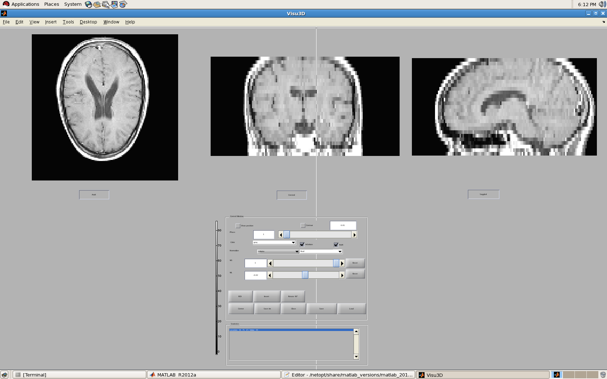

# Visu3D

This constructs a view of the MRI through all 3 anatomical slices.

## Getting Started

The software is already loaded with the sample MRI of the brain that comes with Matlab.
Run the .m file and click Center. Click on a location on one of the images for the other images to indicate that position in the MRI on all anatomical slices!

## Prerequisites and Installation

Nothing needed besides Matlab and its relevant packages.
